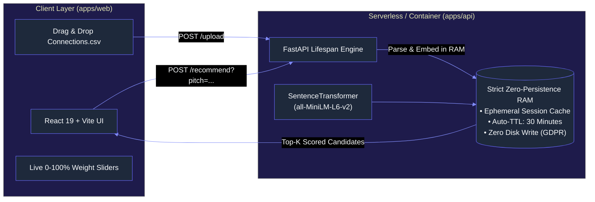

# ConnectRank

[](https://react.dev)
[](https://www.typescriptlang.org)
[](https://vite.dev)
[](https://tailwindcss.com)
[](https://www.radix-ui.com)

[](https://www.python.org)
[](https://fastapi.tiangolo.com)
[](https://pytorch.org)
[](https://huggingface.co/sentence-transformers/all-MiniLM-L6-v2)
[](https://docs.pydantic.dev)

[](https://turbo.build)
[](https://pnpm.io)
[](https://pages.cloudflare.com)
[](https://aws.amazon.com/apprunner/)
[](docs/DEPLOYMENT.md)

[](docs/ARCHITECTURE.md)
[](docs/CONTRIBUTING.md)
[](docs/CONTRIBUTING.md)
[](LICENSE)

An enterprise-grade, privacy-first **fullstack monorepo** that transforms your exported LinkedIn network into high-yield cold outreach opportunities. It combines **dense semantic vector similarity** (matching your pitch to experience) with **deterministic decision-maker weights** (prioritizing CTOs, Founders, and Engineering Leads).

---

## Architecture Overview



---

## Key Features

* 🔒 **Zero-Persistence Privacy (GDPR Article 17 Compliant):** Upload your `Connections.csv` directly in the browser. Tabular data and vectors exist **strictly in volatile RAM**. No PII is written to disk or databases, and sessions auto-purge after 30 minutes of inactivity or immediately upon clicking **'Purge My Data'**.
* 🌓 **Persistent Dual-Theme Engine (Light & Dark Mode):** Instant, zero-flicker theme switching persisted in `localStorage` using Tailwind CSS v4 custom variants, featuring sleek ambient radial glows in dark mode and high-contrast clarity in light mode.
* 🚀 **Modern SaaS Landing Page & Capabilities Matrix:** High-converting landing page elements inspired by modern AI apps, including live proof metrics, real tech ecosystem integration, targeted professional personas, and transparent open-source model disclosures.
* 🐙 **Open-Source & GitHub Integrated:** Fully open source under the MIT License with direct repository navigation to [github.com/martins-ngene/connectrank](https://github.com/martins-ngene/connectrank).
* ⚡ **Preloaded Demo Mode:** Instant exploratory testing on hundreds of anonymized connection profiles without needing an account or an initial CSV upload.
* 🎛️ **Interactive Scoring Sliders:** Fine-tune the balance between skill relevance (Semantic Cosine Similarity) and hiring authority (CTOs, VPs, Heads of Talent) in real time.
* 🌍 **Remote / Worldwide Classifier:** 3-tier heuristic filter isolating 70+ remote-first organizations and distributed positions.
* ✉️ **1-Click Cold DM Generator:** Generates personalized outreach copy tailored to the candidate's exact seniority tier (Direct Pitch, Referral Inquiry, Consulting/Freelance) with one-click clipboard copy.
* 📦 **Production Monorepo Tooling:** Polyglot pipeline managed by **Turborepo** and **pnpm workspaces** with single-command developer workflows (`pnpm dev`, `pnpm test`, `pnpm build`).

---

## Technologies Used

ConnectRank is architected as a modern polyglot monorepo, pairing state-of-the-art Python ML services with a high-performance React 19 web application.

### 1. Frontend Web Application (`apps/web`)

[](https://react.dev)
[](https://www.typescriptlang.org)
[](https://vite.dev)
[](https://tailwindcss.com)
[](https://www.radix-ui.com)
[](https://lucide.dev)
[](https://sentry.io)

| Technology | Role / Purpose | Key Highlights |
| :--- | :--- | :--- |
| **[React 19](https://react.dev)** | UI Library | Concurrent rendering, modern hooks, server/client component boundaries |
| **[TypeScript](https://www.typescriptlang.org)** | Language & Type Safety | Strict static typing, API client contracts, zero `any` policy |
| **[Vite 6](https://vite.dev)** | Build Tool & Dev Server | Lightning-fast HMR, Rollup production bundling, code-splitting |
| **[Tailwind CSS v4](https://tailwindcss.com)** | CSS Framework | Zero-config CSS-first engine, `@custom-variant`, dual-theme tokens |
| **[Radix UI](https://www.radix-ui.com)** | Accessible Primitives | WAI-ARIA compliant Dialog, Slider, and Tooltip headless components |
| **[Lucide React](https://lucide.dev)** | Iconography | Clean, consistent SVG icons with tree-shaking support |
| **[@sentry/react](https://sentry.io)** | Telemetry & Observability | Client error boundaries, exception capture, and zero-PII APM |

### 2. Backend & ML Inference Engine (`apps/api`)

[](https://www.python.org)
[](https://fastapi.tiangolo.com)
[](https://pytorch.org)
[](https://huggingface.co/sentence-transformers/all-MiniLM-L6-v2)
[](https://docs.pydantic.dev)
[](https://numpy.org)
[](https://sentry.io)

| Technology | Role / Purpose | Key Highlights |
| :--- | :--- | :--- |
| **[FastAPI](https://fastapi.tiangolo.com)** | Web Framework | Async lifespan hooks, OpenAPI 3.1 generation, high-throughput ASGI |
| **[PyTorch (CPU)](https://pytorch.org)** | Tensor Processing Engine | Lightweight CPU tensor operations for low-latency dense vector scoring |
| **[Sentence-Transformers](https://huggingface.co/sentence-transformers/all-MiniLM-L6-v2)** | Semantic Embeddings | `all-MiniLM-L6-v2` 384-dimensional dense semantic mapping |
| **[Pydantic v2](https://docs.pydantic.dev)** | Data Validation & Settings | Rust-backed schema validation, typed models, env parsing |
| **[Uvicorn](https://www.uvicorn.org)** | ASGI Web Server | Lightning-fast async server implementation using uvloop and httptools |
| **[NumPy](https://numpy.org)** | Matrix Math | Vectorized cosine similarity dot-products across candidate embeddings |
| **[sentry-sdk](https://sentry.io)** | Error APM & Monitoring | Starlette/FastAPI tracing with custom PII data redacting hooks |

### 3. Monorepo Orchestration & Tooling

[](https://turbo.build)
[](https://pnpm.io)
[](https://www.gnu.org/software/make/)

| Tool | Role / Purpose | Key Highlights |
| :--- | :--- | :--- |
| **[Turborepo](https://turbo.build)** | Monorepo Build System | Task scheduling, fingerprint hashing, cached builds, pipeline filters |
| **[pnpm Workspaces](https://pnpm.io)** | Package Management | Content-addressable storage, symlink isolation, monorepo scripts |
| **[Makefile](https://www.gnu.org/software/make/)** | Polyglot Task Runner | Unified interface bridging Node (`pnpm`) and Python (`venv`) |

### 4. Testing & Quality Assurance

[](https://docs.pytest.org)
[](https://vitest.dev)
[](https://testing-library.com)
[](https://github.com/jsdom/jsdom)

| Tool | Scope | Highlights |
| :--- | :--- | :--- |
| **[Pytest](https://docs.pytest.org)** | Backend Unit & Integration Tests | 18 tests covering API routes, heuristics, session TTL, and scoring |
| **[pytest-asyncio](https://github.com/pytest-dev/pytest-asyncio)** | Asynchronous Backend Testing | Strict event loop fixtures testing async FastAPI lifespan & endpoints |
| **[Vitest](https://vitest.dev)** | Frontend Unit & Component Tests | 21 tests covering UI components, sliders, pagination, modals, themes |
| **[Testing Library](https://testing-library.com)** | DOM Assertions | User-centric UI event testing with `@testing-library/jest-dom` |
| **[jsdom](https://github.com/jsdom/jsdom)** | Browser Environment Emulation | Headless in-memory DOM simulation for component rendering |

### 5. DevOps, Containerization & Cloud Infrastructure

[](https://www.docker.com)
[](https://docs.docker.com/compose/)
[](https://nginx.org)
[](https://pages.cloudflare.com)
[](https://aws.amazon.com/apprunner/)

| Technology | Deployment Tier | Purpose |
| :--- | :--- | :--- |
| **[Docker](https://www.docker.com)** | Container Runtime | Multi-stage Dockerfiles for optimized production images |
| **[Docker Compose](https://docs.docker.com/compose/)** | Local Orchestration | Single-command cluster provisioning (`connectrank-api` + `connectrank-web`) |
| **[Nginx](https://nginx.org)** | Container Web Server | Lightweight Alpine container hosting Vite SPA assets for containerized runs |
| **[Cloudflare Pages](https://pages.cloudflare.com)** | Production Frontend CDN | Zero-cost edge hosting ($0 egress, unlimited bandwidth, global SSL) |
| **[AWS App Runner](https://aws.amazon.com/apprunner/)** | Production Backend Hosting | Fully managed serverless container runtime (1 vCPU / 2GB RAM, ~$11/mo) |

---

## Documentation Directory

| Document | Description |
| :--- | :--- |
| 📘 [**docs/ARCHITECTURE.md**](docs/ARCHITECTURE.md) | C4 architecture diagrams, mathematical composite scoring formula, and AWS cloud topology. |
| 📙 [**docs/MONOREPO.md**](docs/MONOREPO.md) | Turborepo workspace reference, pipeline configurations, and caching guide. |
| 📗 [**docs/CONTRIBUTING.md**](docs/CONTRIBUTING.md) | Local developer setup, branching model, code styles, and testing instructions. |
| 📕 [**docs/API.md**](docs/API.md) | OpenAPI reference for all endpoints (`/health`, `/upload`, `/recommend`, `/session/purge`) with cURL & code samples. |
| 🚀 [**docs/DEPLOYMENT.md**](docs/DEPLOYMENT.md) | Production checklist, AWS App Runner & S3/CloudFront provisioning, env vars, and smoke testing. |

---

## Quickstart

### Prerequisites
* **Node.js** v20+ & **pnpm** v10+ (`npm i -g pnpm`)
* **Python** 3.11+
* **Virtual Environment**

### 1. Setup All Workspaces
```bash
make setup
# OR:
pnpm install
./venv/bin/pip install -r apps/api/requirements.txt
./venv/bin/pip install -r apps/api/requirements-dev.txt
```

### 2. Start Development Server
```bash
make dev
# OR:
pnpm dev
```
* **Frontend Web App:** [http://localhost:5173](http://localhost:5173)
* **Backend Swagger UI:** [http://localhost:8080/docs](http://localhost:8080/docs)
* **Interactive ReDoc:** [http://localhost:8080/redoc](http://localhost:8080/redoc)

### 3. Run Automated Tests
```bash
# Run both backend and frontend test suites
make test
# OR:
pnpm test
```

### 4. Build Production Bundles
```bash
make build
# OR:
pnpm build
```

---

## Docker Compose (Local Multi-Container)

To run the fullstack environment in isolated Docker containers:
```bash
make docker-up
# OR:
docker compose up --build
```
* Web: [http://localhost:3000](http://localhost:3000)
* API: [http://localhost:8080](http://localhost:8080)

---

## Cloud Deployment (Cloudflare Pages + AWS App Runner)
 
- **Frontend (`apps/web`):** Deployed to **Cloudflare Pages** ($0.00 egress, unlimited bandwidth, global Anycast edge network) with automated Git CI/CD and custom domain SSL.
- **Backend (`apps/api`):** Deployed to **AWS App Runner** (1 vCPU / 2 GB RAM) using `apps/api/Dockerfile`, pre-baked with Hugging Face model weights and CPU PyTorch.
- 💰 **Budget & Cost Model:** Engineered strictly to operate under **$100 for 6 months** (~$11.22/mo projected spend; 32% unallocated safety margin) backed by **AWS Budgets** ($15/mo ceiling) and CloudWatch Billing Alarms.
- 📋 **Step-by-Step Guide:** Follow the [**Production Deployment & Cost Optimization Guide (`docs/DEPLOYMENT.md`)**](docs/DEPLOYMENT.md) for billing alerts, ECR image publishing, Cloudflare Pages integration, and post-deployment smoke tests.

---

## License & Legal Disclaimer

This project is licensed under the MIT License. This utility is an independent open-source project and is **not affiliated with, sponsored by, or endorsed by LinkedIn Corporation or Microsoft Corporation**.