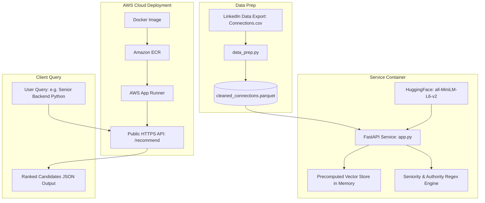
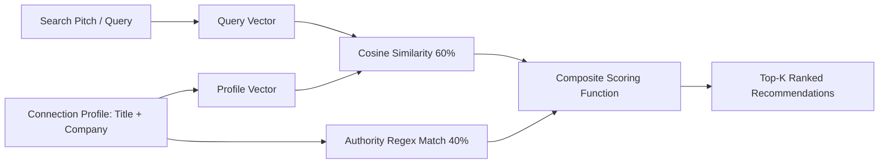
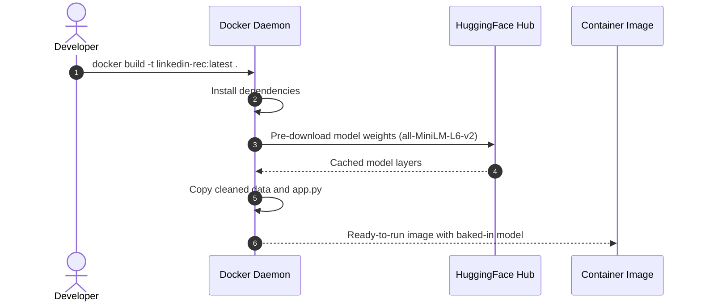
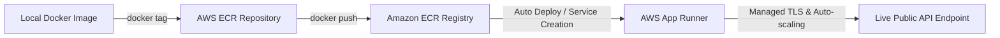

# LinkedIn Opportunity Recommender Engine

An end-to-end semantic search and heuristic decision engine deployed on **AWS App Runner** that ranks your LinkedIn connections based on their authority to hire, grant freelance gigs, or refer you to engineering roles.

---

## Architecture Overview



---

## Ranking & Scoring Methodology

The recommendation engine combines **dense semantic vector similarity** with **deterministic decision-maker weights**:



### Composite Formula
$$\text{Final Score}_i = 0.60 \times \text{CosineSimilarity}(\vec{q}, \vec{c}_i) + 0.40 \times \text{AuthorityWeight}(c_i)$$

* **Semantic Similarity (60%):** Matches the relevance of the connection's title and company to your target pitch (e.g., matching "Distributed Systems", "Backend Engineer", "Infrastructure").
* **Authority Weight (40%):**
  * **1.0 (Direct Decision-Makers):** Founder, Co-Founder, CTO, VP of Engineering, Head of Talent, Technical Recruiter.
  * **0.7 (Engineering Managers & Leads):** Director, Engineering Manager, Lead Engineer, Architect.
  * **0.4 (Peer Referrals):** Senior Engineer, Staff Engineer, Principal Engineer.
  * **0.1 (Other):** Unrelated functions.

---

## Directory Structure

```plaintext
linkedin-recommender/
│
├── data/
│   ├── Connections.csv              # Raw export from LinkedIn
│   └── cleaned_connections.parquet  # Cleaned, token-optimized data
│
├── app/
│   └── app.py                       # FastAPI application & scoring engine
│
├── scripts/
│   └── data_prep.py                 # Data cleaning and normalization script
│
├── Dockerfile                       # Multi-stage/cached model Dockerfile
├── requirements.txt                 # Pinned dependencies
└── README.md                        # Documentation
```

---

## Quickstart (Local Development)

### 1. LinkedIn Data Export
1. Log in to LinkedIn and navigate to **Settings & Privacy > Data Privacy > Get a copy of your data**.
2. Select **Connections** and click **Request archive**.
3. Once received, place the extracted `Connections.csv` in the root or `data/` directory.

### 2. Virtual Environment Setup
```bash
python3 -m venv venv
source venv/bin/activate
pip install -r requirements.txt
```

### 3. Run Preprocessing
LinkedIn includes metadata rows at the top of the file. Run the prep script to sanitize and serialize to Parquet:
```bash
python scripts/data_prep.py
```

### 4. Run API Locally
```bash
uvicorn app.app:app --reload --port 8080
```
Open interactive docs at `http://localhost:8080/docs`.

---

## Containerization



Build and run locally:
```bash
docker build -t linkedin-rec:latest .
docker run -p 8080:8080 linkedin-rec:latest
```

---

## AWS Deployment Workflow



### Step-by-Step Deployment Commands

```bash
# 1. Configure environment
export AWS_REGION="us-east-1"
export ACCOUNT_ID=$(aws sts get-caller-identity --query Account --output text)
export REPO_NAME="linkedin-recommender"

# 2. Authenticate Docker with Amazon ECR
aws ecr create-repository --repository-name $REPO_NAME --region $AWS_REGION || true
aws ecr get-login-password --region $AWS_REGION | docker login --username AWS --password-stdin $ACCOUNT_ID.dkr.ecr.$AWS_REGION.amazonaws.com

# 3. Tag and Push Container
docker tag linkedin-rec:latest $ACCOUNT_ID.dkr.ecr.$AWS_REGION.amazonaws.com/$REPO_NAME:latest
docker push $ACCOUNT_ID.dkr.ecr.$AWS_REGION.amazonaws.com/$REPO_NAME:latest

# 4. Deploy via AWS App Runner
# In the AWS Console:
# - Go to AWS App Runner -> Create Service
# - Source: Container Registry -> Amazon ECR
# - Image URI: Select $ACCOUNT_ID.dkr.ecr.us-east-1.amazonaws.com/linkedin-recommender:latest
# - Port: 8080
# - Specs: 1 vCPU, 2 GB Memory
# - Deploy!
```

---

## API Documentation

### `GET /health`
Verifies service status and returns total loaded connections.

**Response:**
```json
{
  "status": "healthy",
  "profiles_indexed": 1420
}
```

### `POST /recommend`
Queries your network with semantic search criteria.

**Query Parameters:**
* `pitch` *(string, required)*: The role, skill set, or gig you are offering (e.g. `"Senior Backend Python Flask APIs AWS Cloud"`).
* `top_k` *(int, default: 15)*: Number of candidates to return.

**Sample Request:**
```bash
curl -X POST "https://<apprunner-endpoint>.awsapprunner.com/recommend?pitch=Senior%20Python%20Backend%20Engineer%20FastAPI%20AWS&top_k=5"
```

**Sample Response:**
```json
[
  {
    "name": "Alex Smith",
    "position": "VP of Engineering",
    "company": "CloudScale Systems",
    "url": "https://www.linkedin.com/in/alexsmith",
    "score": 88.4,
    "reason": "Semantic match: 80.7% | Decision weight: 1.0"
  },
  {
    "name": "Sarah Doe",
    "position": "Engineering Manager - Platform",
    "company": "Fintech Global",
    "url": "https://www.linkedin.com/in/sarahdoe",
    "score": 79.2,
    "reason": "Semantic match: 85.3% | Decision weight: 0.7"
  }
]
```

---

## Security & LinkedIn Compliance

* **Data Privacy:** Uses purely official personal archives (`Connections.csv`) obtained via GDPR/CCPA export rights.
* **No Web Scraping:** Does not run automated crawlers or headless browsers against LinkedIn, avoiding IP blocks or account suspensions.
* **Network Isolation:** Precomputed vectors reside solely in internal memory and encrypted AWS storage.