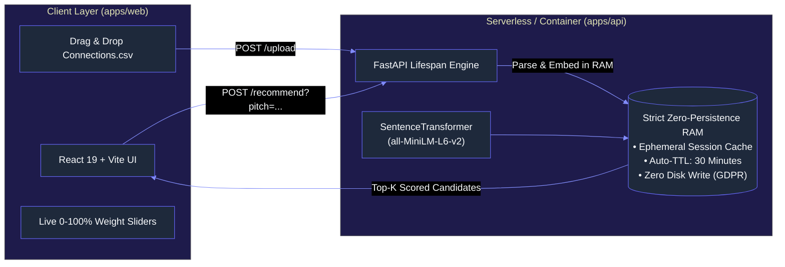

# LinkedIn Opportunity & Cold DM Recommender

[](https://turbo.build)
[](https://fastapi.tiangolo.com)
[](https://react.dev)
[](https://tailwindcss.com)
[](docs/ARCHITECTURE.md)
[](docs/CONTRIBUTING.md)

An enterprise-grade, privacy-first **fullstack monorepo** that transforms your exported LinkedIn network into high-yield cold outreach opportunities. It combines **dense semantic vector similarity** (matching your pitch to experience) with **deterministic decision-maker weights** (prioritizing CTOs, Founders, and Engineering Leads).

---

## Architecture Overview



---

## Key Features

* 🔒 **Zero-Persistence Privacy (GDPR Article 17 Compliant):** Upload your `Connections.csv` directly in the browser. Tabular data and vectors exist **strictly in volatile RAM**. No PII is written to disk or databases, and sessions auto-purge after 30 minutes of inactivity or immediately upon clicking **'Purge My Data'**.
* ⚡ **Preloaded Demo Mode:** Instant exploratory testing on hundreds of anonymized connection profiles without needing an account or an initial CSV upload.
* 🎛️ **Interactive Scoring Sliders:** Fine-tune the balance between skill relevance (Semantic Cosine Similarity) and hiring authority (CTOs, VPs, Heads of Talent) in real time.
* ✉️ **1-Click Cold DM Generator:** Generates personalized outreach copy tailored to the candidate's exact seniority tier (Direct Pitch, Referral Inquiry, Consulting/Freelance) with one-click clipboard copy.
* 📦 **Production Monorepo Tooling:** Polyglot pipeline managed by **Turborepo** and **pnpm workspaces** with single-command developer workflows (`pnpm dev`, `pnpm test`, `pnpm build`).

---

## Documentation Directory

| Document | Description |
| :--- | :--- |
| 📘 [**docs/ARCHITECTURE.md**](docs/ARCHITECTURE.md) | C4 architecture diagrams, mathematical composite scoring formula, and AWS cloud topology. |
| 📙 [**docs/MONOREPO.md**](docs/MONOREPO.md) | Turborepo workspace reference, pipeline configurations, and caching guide. |
| 📗 [**docs/CONTRIBUTING.md**](docs/CONTRIBUTING.md) | Local developer setup, branching model, code styles, and testing instructions. |
| 📕 [**docs/API.md**](docs/API.md) | OpenAPI reference for all endpoints (`/health`, `/upload`, `/recommend`, `/session/purge`) with cURL & code samples. |

---

## Quickstart

### Prerequisites
* **Node.js** v20+ & **pnpm** v10+ (`npm i -g pnpm`)
* **Python** 3.11+
* **Virtual Environment**

### 1. Setup All Workspaces
```bash
make setup
# OR:
pnpm install
./venv/bin/pip install -r apps/api/requirements.txt
./venv/bin/pip install -r apps/api/requirements-dev.txt
```

### 2. Start Development Server
```bash
make dev
# OR:
pnpm dev
```
* **Frontend Web App:** [http://localhost:5173](http://localhost:5173)
* **Backend Swagger UI:** [http://localhost:8080/docs](http://localhost:8080/docs)
* **Interactive ReDoc:** [http://localhost:8080/redoc](http://localhost:8080/redoc)

### 3. Run Automated Tests
```bash
# Run both backend and frontend test suites
make test
# OR:
pnpm test
```

### 4. Build Production Bundles
```bash
make build
# OR:
pnpm build
```

---

## Docker Compose (Local Multi-Container)

To run the fullstack environment in isolated Docker containers:
```bash
make docker-up
# OR:
docker compose up --build
```
* Web: [http://localhost:3000](http://localhost:3000)
* API: [http://localhost:8080](http://localhost:8080)

---

## Cloud Deployment (AWS)

* **Backend (`apps/api`):** Deployed to **AWS App Runner** using `apps/api/Dockerfile`. The image is pre-baked with Hugging Face model weights and a lightweight CPU PyTorch wheel (~150MB).
* **Frontend (`apps/web`):** Static SPA build (`apps/web/dist`) deployed to **Amazon S3 + CloudFront** (or AWS Amplify / Vercel) for sub-50ms global edge delivery.

---

## License & Legal Disclaimer

This project is licensed under the MIT License. This utility is an independent open-source project and is **not affiliated with, sponsored by, or endorsed by LinkedIn Corporation or Microsoft Corporation**.