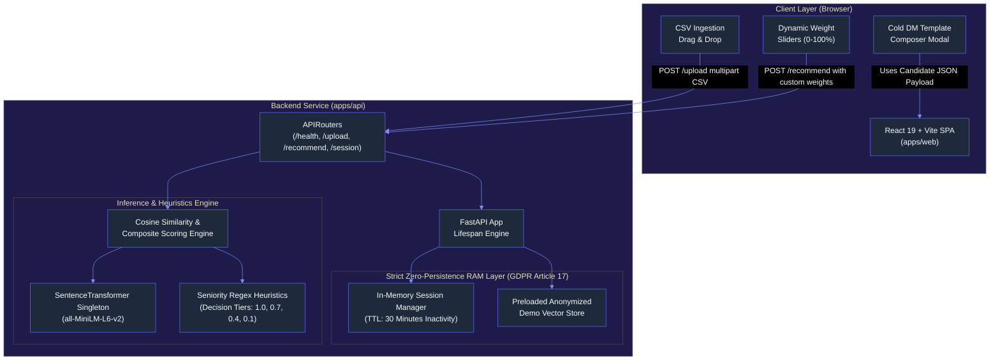
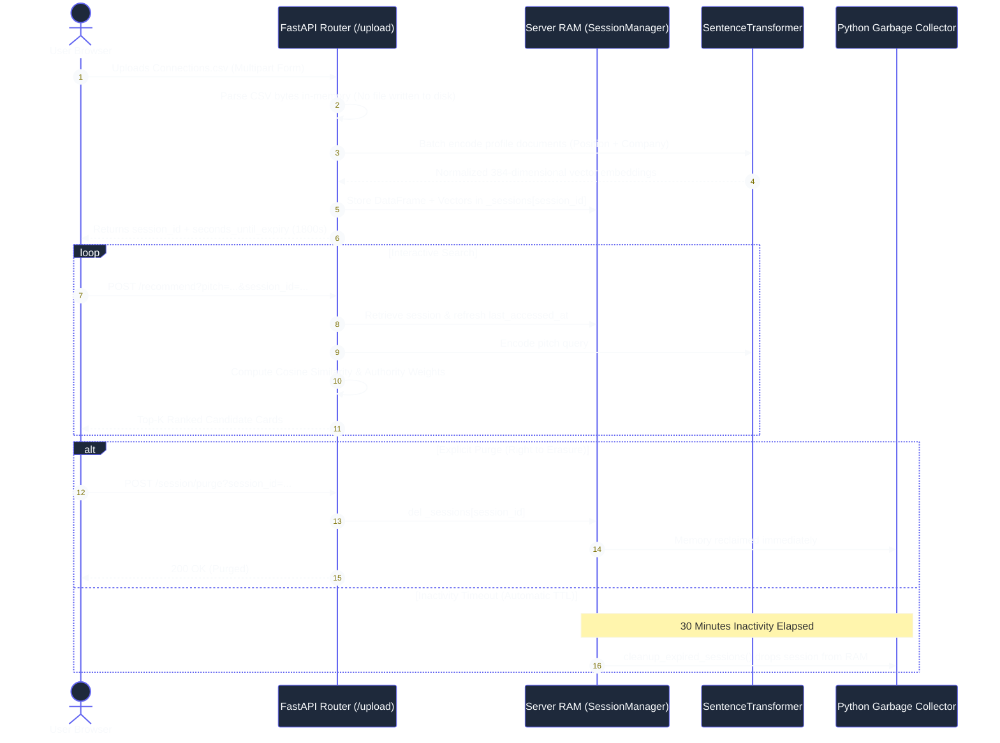
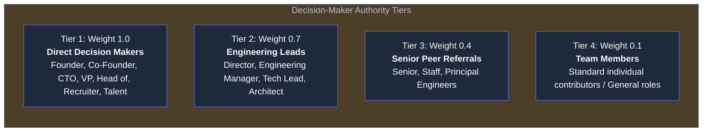
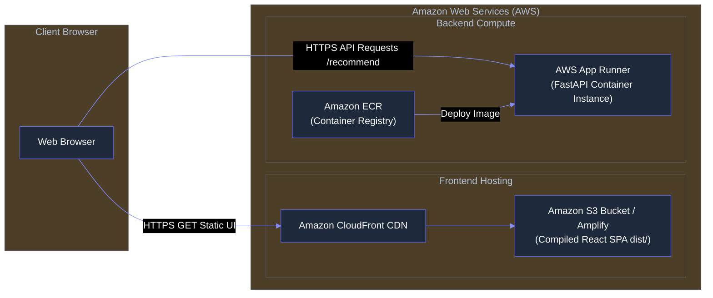

# System Architecture & Technical Specification

This document provides a comprehensive technical overview of the **LinkedIn Cold DM Recommender Engine**, covering system design, ephemeral memory management, the composite scoring model, and cloud deployment topology.

---

## 1. High-Level System Architecture

---

## 2. GDPR Zero-Persistence & Ephemeral Session Lifecycle

The platform enforces a **strict privacy-by-design policy** where user data is never committed to persistent storage.

### Privacy Guarantees
1. **No Accounts or Credentials:** No registration, email addresses, or password management required.
2. **Volatile RAM Only:** At no point during ingestion, parsing, or vector calculation are profiles saved to disk, relational databases, or cloud object stores (S3).
3. **Automated Eviction:** An automatic sliding window timer cleans up inactive sessions after 30 minutes of inactivity.
4. **GDPR Article 17 (Right to Erasure):** A user can invoke `POST /session/purge` at any time to instantly remove all vectors and tabular data from server memory.

---

## 3. Mathematical Scoring Model

Recommendations are ordered by a **hybrid composite function** balancing dense semantic vector proximity with deterministic decision-making authority:

$$\text{Final Score} = \left( w_s \times \text{CosineSimilarity}(\vec{q}, \vec{c}_i) \right) + \left( w_a \times \text{AuthorityWeight}(c_i) \right)$$

Where:
* $\vec{q} \in \mathbb{R}^{384}$: L2-normalized embedding of the user's pitch query.
* $\vec{c}_i \in \mathbb{R}^{384}$: L2-normalized embedding of connection profile document $i$ ($\text{Title} + \text{" at "} + \text{Company}$).
* $w_s$: Semantic match weight (default: $0.60$).
* $w_a$: Seniority authority weight (default: $0.40$).
* $w_s + w_a = 1.0$ (normalized dynamically if customized via UI sliders).

### Seniority Heuristics & Tier Classifications

---

## 4. Cloud Deployment Architecture (AWS)

### Component Roles:
* **Frontend:** Static SPA build (`dist/`) hosted on Amazon S3 and distributed globally via Amazon CloudFront (or Vercel / Cloudflare Pages) for sub-50ms latency.
* **Backend:** Single containerized service deployed to **AWS App Runner** using the optimized CPU PyTorch `Dockerfile`.
