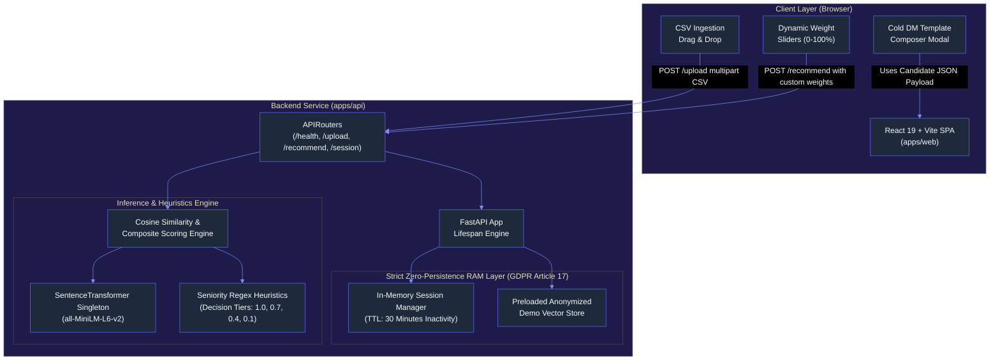
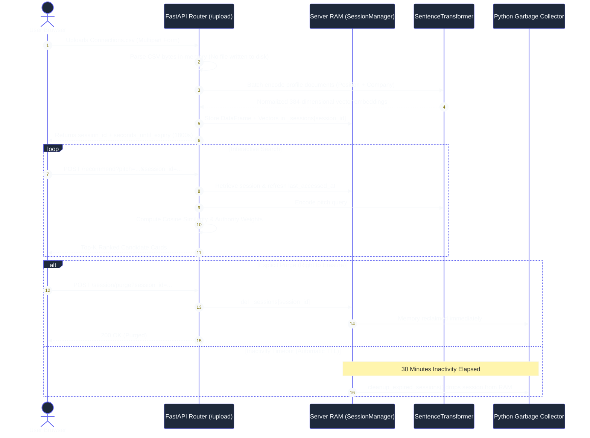
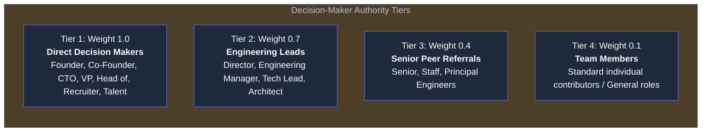

# System Architecture & Technical Specification

[](docs/ARCHITECTURE.md)
[](https://fastapi.tiangolo.com)
[](https://huggingface.co/sentence-transformers/all-MiniLM-L6-v2)
[](https://react.dev)
[](https://tailwindcss.com)
[](docs/ARCHITECTURE.md)
[](https://sentry.io)
[](https://aws.amazon.com)

This document provides a comprehensive technical overview of **ConnectRank**, covering system design, ephemeral memory management, the composite scoring model, and cloud deployment topology.

---

## 1. High-Level System Architecture



---

## 2. GDPR Zero-Persistence & Ephemeral Session Lifecycle

The platform enforces a **strict privacy-by-design policy** where user data is never committed to persistent storage.



### Privacy Guarantees
1. **No Accounts or Credentials:** No registration, email addresses, or password management required.
2. **Volatile RAM Only:** At no point during ingestion, parsing, or vector calculation are profiles saved to disk, relational databases, or cloud object stores (S3).
3. **Automated Eviction:** An automatic sliding window timer cleans up inactive sessions after 30 minutes of inactivity.
4. **GDPR Article 17 (Right to Erasure):** A user can invoke `POST /session/purge` at any time to instantly remove all vectors and tabular data from server memory.

---

## 3. Mathematical Scoring Model

Recommendations are ordered by a **hybrid composite function** balancing dense semantic vector proximity with deterministic decision-making authority:

$$\text{Final Score} = \left( w_s \times \text{CosineSimilarity}(\vec{q}, \vec{c}_i) \right) + \left( w_a \times \text{AuthorityWeight}(c_i) \right)$$

Where:
* $\vec{q} \in \mathbb{R}^{384}$: L2-normalized embedding of the user's pitch query.
* $\vec{c}_i \in \mathbb{R}^{384}$: L2-normalized embedding of connection profile document $i$ ($\text{Title} + \text{" at "} + \text{Company}$).
* $w_s$: Semantic match weight (default: $0.60$).
* $w_a$: Seniority authority weight (default: $0.40$).
* $w_s + w_a = 1.0$ (normalized dynamically if customized via UI sliders).

### Seniority Heuristics & Tier Classifications



---

## 4. Cloud Deployment Architecture (Cloudflare Pages + AWS App Runner)

```mermaid
%%{init: {
  'theme': 'base',
  'themeVariables': {
    'darkMode': true,
    'background': '#0b0f19',
    'primaryColor': '#1e293b',
    'primaryTextColor': '#f8fafc',
    'primaryBorderColor': '#6366f1',
    'lineColor': '#818cf8'
  }
}}%%
flowchart LR
    subgraph Client ["Client Layer"]
        BROWSER["Web Browser"]
    end

    subgraph CloudflareCloud ["Cloudflare Edge ($0.00/mo)"]
        CF_PAGES["Cloudflare Pages CDN<br>(Compiled React SPA dist/)<br>• Zero Egress Bandwidth Fees<br>• SPA Fallback (_redirects -> 200)"]
    end

    subgraph AWSCloud ["Amazon Web Services (AWS ~$11.22/mo)"]
        subgraph ContainerCompute ["Backend Compute"]
            ECR["Amazon ECR<br>(connectrank-api:latest)"]
            APPRUNNER["AWS App Runner<br>(1 vCPU / 2GB RAM Container)<br>• Port 8080 | Health: /health"]
        end

        subgraph Guardrails ["Cost Guardrails"]
            BUDGETS["AWS Budgets ($15/mo Cap)"]
            ALARMS["CloudWatch Billing Alarms"]
        end
    end

    BROWSER -->|HTTPS GET Static UI (Edge CDN)| CF_PAGES
    BROWSER -->|HTTPS API POST /recommend| APPRUNNER
    ECR -->|Deploy Image| APPRUNNER
    APPRUNNER -.-> Guardrails
```

### Component Roles:
* **Frontend:** Static SPA build (`dist/`) hosted on **Cloudflare Pages** for zero-cost, sub-50ms edge delivery with unlimited requests and zero egress bandwidth fees.
* **Backend:** Serverless container service deployed to **AWS App Runner** (1 vCPU / 2 GB RAM) using the optimized CPU PyTorch `Dockerfile`, capped to a $100 / 6-month budget.
* **Deployment Guide:** Complete step-by-step checklist, cost breakdown, and billing alarms are documented in [**docs/DEPLOYMENT.md**](DEPLOYMENT.md).

---

## 5. Technology Stack Mapping by Architectural Layer

| Architectural Tier | Primary Technologies | Badges | Architecture Responsibilities |
| :--- | :--- | :--- | :--- |
| **Presentation Tier** (`apps/web`) | React 19, TypeScript, Vite, Tailwind CSS v4, Radix UI | [](https://react.dev) [](https://tailwindcss.com) [](https://typescriptlang.org) | Renders responsive SPA interface, manages dynamic client weighting state, enforces accessible WAI-ARIA dialogs, handles persistent dual-theme switching. |
| **Application & API Gateway** (`apps/api`) | FastAPI, Python 3.13, Pydantic v2, Uvicorn | [](https://fastapi.tiangolo.com) [](https://pydantic.dev) | Enforces strict OpenAPI schema contracts, executes async request lifecycle, parses multipart CSV uploads, validates pitch search requests. |
| **Machine Learning & Inference** | PyTorch (CPU), SentenceTransformers, NumPy | [](https://pytorch.org) [](https://huggingface.co) | Computes 384-dimensional dense semantic vectors using `all-MiniLM-L6-v2`, runs vectorized cosine similarity matrix dot products. |
| **Zero-Persistence Data Layer** | In-Memory Session Cache (`SessionManager`) | [](docs/ARCHITECTURE.md) | Ephemeral RAM storage, automatic 30-minute rolling TTL inactivity eviction, single-click instant purge endpoint; zero disk I/O. |
| **Observability & APM** | Sentry SDK (FastAPI + React), Error Boundaries | [](https://sentry.io) | Real-time fullstack exception tracing, React glassmorphic crash boundary fallback, and automated GDPR PII scrubbing before payload transmission. |
| **Monorepo & Build System** | Turborepo, pnpm Workspaces | [](https://turbo.build) [](https://pnpm.io) | Polyglot pipeline orchestrator running parallel TypeScript and Python test/build tasks with content-hash artifact caching. |
| **Cloud & Deployment** | Cloudflare Pages, AWS App Runner, Docker | [](https://pages.cloudflare.com) [](https://aws.amazon.com) | Multi-stage containerization, serverless autoscaling backend compute, zero-cost edge static frontend hosting ($0 egress). |

