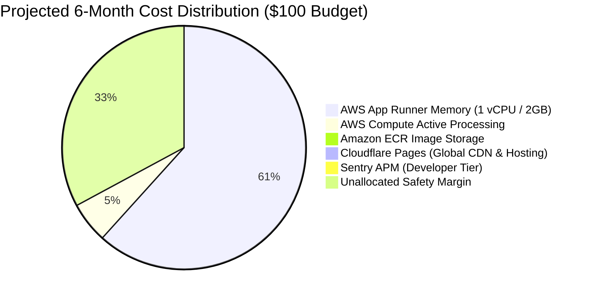

# ConnectRank Production Deployment & Cost Optimization Guide

[](https://pages.cloudflare.com)
[](https://aws.amazon.com/apprunner/)
[](docs/DEPLOYMENT.md#1-financial-architecture--6-month-budget-model)
[](docs/DEPLOYMENT.md#2-aws-billing-alerts--cost-guardrails)
[](docs/ARCHITECTURE.md)
[](https://sentry.io)

This guide details the cost-engineered, high-performance production architecture for **ConnectRank**, pairing **Cloudflare Pages** for the static frontend ($0.00 egress & hosting) with **AWS App Runner** for the containerized FastAPI inference engine.

---

## 1. Financial Architecture & 6-Month Budget Model

Our strict budget constraint is **$100.00 across 6 months** ($\approx \$16.66 / \text{month}$ ceiling). The architecture is intentionally modeled to operate at **$\approx \$11.00 - \$12.00 / \text{month}$**, leaving a **~$30.00 safety buffer** (30% headroom).



### Comprehensive Cost Breakdown

| Component | Provider & Tier | Monthly Cost | 6-Month Total | Notes / Optimization |
| :--- | :--- | :--- | :--- | :--- |
| **Frontend Web App** | **Cloudflare Pages** (Free) | **$0.00** | **$0.00** | Unlimited bandwidth, 0 egress fees, free SSL, global Anycast edge CDN. |
| **Backend Memory** | **AWS App Runner** (2 GB RAM) | **$10.22** | **$61.32** | $0.007 / GB-hour $\times$ 2 GB $\times$ 730 hours/mo. |
| **Backend Compute** | **AWS App Runner** (1 vCPU) | **~$0.90** | **~$5.40** | $0.064 / vCPU-hour (billed only while actively computing searches; ~15 hrs/mo). |
| **Container Registry** | **Amazon ECR** (Private) | **~$0.10** | **~$0.60** | 1 image tag (~1.2 GB); first 500 MB free, $0.10/GB for remainder. |
| **Data Transfer Out** | **AWS Out to Internet** | **$0.00** | **$0.00** | AWS provides first 100 GB/month data transfer out for free. |
| **Observability / APM** | **Sentry** (Developer Free) | **$0.00** | **$0.00** | 5,000 error events & 10,000 performance transactions/month included. |
| **Safety Headroom** | **Unallocated Buffer** | — | **$32.68** | Absorbs traffic spikes or additional compute without breaching $100. |
| **Total Projected** | | **~$11.22 / mo** | **~$67.32** | **32.7% under $100 budget** |

---

## 2. Architecture Topology

```mermaid
flowchart TD
    subgraph Users ["Client Layer"]
        Browser["User Browser (Desktop / Mobile)"]
    end

    subgraph Cloudflare ["Cloudflare Edge Network ($0.00/mo)"]
        Pages["Cloudflare Pages CDN<br>• Zero Egress Bandwidth Fees<br>• SPA Fallback (_redirects -> 200)<br>• Global Anycast SSL / HTTP/3"]
    end

    subgraph AWS ["Amazon Web Services (AWS App Runner ~$11.22/mo)"]
        AppRunner["AWS App Runner Container Service<br>• 1 vCPU / 2 GB RAM (Cost-Optimized)<br>• Port 8080 | Health Check: /health<br>• Min Instances: 1, Max Instances: 1<br>• Strict CORS Whitelist"]
        ECR["Amazon ECR<br>(connectrank-api:latest)"]
    end

    subgraph CostControl ["Cost Control & Telemetry Guardrails"]
        Budgets["AWS Budgets ($15.00/mo Ceiling)<br>• 50%, 80%, 100% Alert Thresholds"]
        Alarms["CloudWatch Billing Alarm<br>• SNS Email Trigger at $12.00"]
        SentryCloud["Sentry APM (Free Tier)<br>• PII Redacted via before_send Hook"]
    end

    Browser -->|1. Static Assets GET (Instant Edge)| Pages
    Browser -->|2. POST /recommend (JSON REST API)| AppRunner
    ECR -->|Container Deployment| AppRunner
    AppRunner -.-> CostControl
    Pages -.-> SentryCloud
    AppRunner -.-> SentryCloud
```

---

## 3. AWS Billing Alerts & Cost Guardrails (Mandatory Step)

To guarantee that your AWS account never exceeds the $100 limit, set up both **AWS Budgets** and **CloudWatch Billing Alarms** prior to launching:

### Step 3.1: Configure AWS Budgets ($15.00 Monthly Ceiling)

1. Open the [AWS Billing & Cost Management Console](https://console.aws.amazon.com/cost-management/home#/budgets).
2. Click **Create Budget** $\rightarrow$ Select **Cost Budget (Recommended)**.
3. Configure the budget parameters:
   - **Budget Name**: `connectrank-monthly-cost-cap`
   - **Period**: `Monthly`
   - **Budget Effective Date**: Current Month
   - **Budget Amount**: Fixed $\rightarrow$ **`$15.00`**
4. Configure **Alert Thresholds**:
   - **Alert 1**: Trigger at **50% ($7.50)** of budgeted amount (Actual) $\rightarrow$ Add your email address.
   - **Alert 2**: Trigger at **80% ($12.00)** of budgeted amount (Actual) $\rightarrow$ Add your email address.
   - **Alert 3**: Trigger at **100% ($15.00)** of budgeted amount (Forecasted) $\rightarrow$ Add your email address.
5. Click **Create Budget**.

### Step 3.2: Enable CloudWatch Billing Alarm (Estimated Charges)

1. Navigate to **Billing Preferences** in the AWS Billing Console and ensure **"Receive Billing Alerts"** is checked.
2. Open the [CloudWatch Console in `us-east-1` (N. Virginia)](https://console.aws.amazon.com/cloudwatch/home?region=us-east-1#alarmsV2:).
3. Click **Create Alarm** $\rightarrow$ Select metric **Billing $\rightarrow$ Total Estimated Charge $\rightarrow$ Currency: USD**.
4. Configure parameters:
   - **Statistic**: Maximum
   - **Period**: 6 hours
   - **Threshold**: Static $\rightarrow$ Greater than $\rightarrow$ **`$12.00`**
5. **Notification**: Select or create an SNS Topic (e.g. `connectrank-billing-alert`) and confirm subscription in your email inbox.

### Step 3.3: App Runner Cost Containment Settings

To prevent runaway auto-scaling from bots or excessive queries:
- Set **Max Instances** to **`1`** (or `2` at most).
- Set **Max Concurrency** to **`100`** requests per instance.
- Set **Session TTL** in backend to **`30`** minutes (`SESSION_TTL_MINUTES=30`).

---

## 4. Environment Variables Specification

### Backend Environment Variables (`apps/api` on AWS App Runner)

| Variable | Recommended Production Value | Required? | Purpose |
| :--- | :--- | :--- | :--- |
| `PORT` | `8080` | Yes | HTTP listening port for App Runner container |
| `ENVIRONMENT` | `production` | Yes | Sentry environment grouping and logging mode |
| `CORS_ORIGINS` | `https://connectrank.pages.dev,https://<your-custom-domain>` | **Yes** | **Strict domain whitelist** (locks down API to your Cloudflare frontend) |
| `SESSION_TTL_MINUTES` | `30` | No (Default: 30) | Inactivity window before RAM session garbage collection |
| `MAX_UPLOAD_SIZE_MB` | `15` | No (Default: 15) | Prevents large multipart memory injection |
| `SENTRY_DSN` | `https://<key>@<org>.ingest.sentry.io/<id>` | Recommended | Server-side APM error tracking (PII redacted) |
| `SENTRY_TRACES_SAMPLE_RATE` | `0.1` (10%) | No (Default: 0.1) | Keeps Sentry transaction quota within free tier |

### Frontend Build-Time Variables (`apps/web` on Cloudflare Pages)

| Variable | Recommended Production Value | Required? | Purpose |
| :--- | :--- | :--- | :--- |
| `VITE_API_URL` | `https://<your-app-runner-id>.us-east-1.awsapprunner.com` | **Yes** | Root URL for REST API communication |
| `VITE_SENTRY_DSN` | `https://<key>@<org>.ingest.sentry.io/<id>` | Recommended | Client-side React Error Boundary reporting |

---

## 5. Backend Deployment (AWS App Runner)

### Step 5.1: Build & Push Image to Amazon ECR

```bash
# 1. Authenticate Docker with Amazon ECR (us-east-1)
aws ecr get-login-password --region us-east-1 | \
  docker login --username AWS --password-stdin <aws_account_id>.dkr.ecr.us-east-1.amazonaws.com

# 2. Create ECR repository (if not already existing)
aws ecr create-repository --repository-name connectrank-api --region us-east-1

# 3. Build the production image with baked model weights
docker build -t connectrank-api:latest -f apps/api/Dockerfile apps/api

# 4. Tag and push image
docker tag connectrank-api:latest <aws_account_id>.dkr.ecr.us-east-1.amazonaws.com/connectrank-api:latest
docker push <aws_account_id>.dkr.ecr.us-east-1.amazonaws.com/connectrank-api:latest
```

### Step 5.2: Create App Runner Service

Configure the service in the AWS App Runner Console:

- [ ] **Source**: Container registry $\rightarrow$ Amazon ECR $\rightarrow$ `connectrank-api:latest`.
- [ ] **Deployment trigger**: Manual or Automatic.
- [ ] **Service Name**: `connectrank-api`.
- [ ] **Virtual CPU & Memory (Cost-Optimized)**:
  - **vCPU**: **`1 vCPU`**
  - **Memory**: **`2 GB`** (adequate for CPU SentenceTransformers and active session cache)
- [ ] **Port**: `8080`.
- [ ] **Health Check**:
  - Protocol: `HTTP`
  - Path: `/health`
  - Interval: `20 seconds`
  - Timeout: `5 seconds`
  - Healthy threshold: `1`
  - Unhealthy threshold: `3`
- [ ] **Auto Scaling (Cost Guardrail)**:
  - Create custom auto scaling configuration:
    - **Min size**: `1`
    - **Max size**: `1` (prevents scaling charges during free/budget periods)
    - **Max concurrency**: `100`
- [ ] **Environment Variables**:
  - `ENVIRONMENT` = `production`
  - `CORS_ORIGINS` = `https://connectrank.pages.dev` (update with your Cloudflare Pages domain)
  - `SENTRY_DSN` = `your_sentry_dsn`

---

## 6. Frontend Deployment (Cloudflare Pages)

Cloudflare Pages provides automated Git deployments, unlimited bandwidth, and native SPA routing.

### Option A: Automatic Deployment via Git (Recommended)

1. Log in to the [Cloudflare Dashboard](https://dash.cloudflare.com/) and navigate to **Workers & Pages**.
2. Click **Create Application** $\rightarrow$ **Pages** $\rightarrow$ **Connect to Git**.
3. Select your repository: `martins-ngene/connectrank` and branch: `main`.
4. Configure Build Settings:
   - **Framework preset**: `Vite`
   - **Root directory**: `apps/web` *(Important: targets the web app directly instead of monorepo root)*
   - **Build command**: `pnpm build`
   - **Build output directory**: `dist`
5. Configure Environment Variables:
   - `VITE_API_URL` = `https://<your-app-runner-id>.us-east-1.awsapprunner.com`
   - `VITE_SENTRY_DSN` = `your_sentry_dsn`
   - `NODE_VERSION` = `22`
6. Click **Save and Deploy**.

> [!NOTE]
> ConnectRank includes an [`apps/web/public/_redirects`](file:///Users/martinium-dev/projects/aws-projects/connectrank/apps/web/public/_redirects) file containing `/* /index.html 200`. Cloudflare Pages automatically recognizes this and serves `index.html` for all client routes, preventing 404s on page refresh.

### Option B: Direct CLI Deployment via Wrangler

You can also deploy directly from your local terminal using the Cloudflare Wrangler CLI:

```bash
# 1. Build the production web bundle with your production API URL
VITE_API_URL="https://<your-app-runner-id>.us-east-1.awsapprunner.com" \
VITE_SENTRY_DSN="https://<your-sentry-dsn>" \
pnpm --filter @connectrank/web build

# 2. Deploy using pnpm dlx wrangler
pnpm dlx wrangler pages deploy apps/web/dist --project-name connectrank
```

---

## 7. Post-Deployment Smoke Test Protocol

Verify system behavior across Cloudflare and AWS:

- [ ] **1. API Health Check**:
  ```bash
  curl -i https://<your-app-runner-id>.us-east-1.awsapprunner.com/health
  # Expected: HTTP 200 OK with {"status":"healthy","version":"1.0.0"}
  ```
- [ ] **2. Strict CORS Verification**:
  ```bash
  # Test with Cloudflare Pages origin (should succeed):
  curl -i -X OPTIONS https://<your-app-runner-id>.us-east-1.awsapprunner.com/recommend \
    -H "Origin: https://connectrank.pages.dev" \
    -H "Access-Control-Request-Method: POST"
  # Expected: HTTP 200 with Access-Control-Allow-Origin: https://connectrank.pages.dev

  # Test with rogue origin (should NOT return Allow-Origin header):
  curl -i -X OPTIONS https://<your-app-runner-id>.us-east-1.awsapprunner.com/recommend \
    -H "Origin: https://unauthorized-attacker.com" \
    -H "Access-Control-Request-Method: POST"
  ```
- [ ] **3. End-to-End User Experience**:
  - Open `https://connectrank.pages.dev` in an incognito window.
  - Test drag-and-drop CSV upload $\rightarrow$ confirm instant candidate table rendering.
  - Test the pitch search input and live scoring sliders $\rightarrow$ verify response within $< 150\text{ms}$.
  - Test the **"Purge My Data"** button $\rightarrow$ confirm RAM memory is purged immediately.
- [ ] **4. Sentry Telemetry Verification**:
  - Open the Sentry dashboard and confirm events arrive under the `production` environment.
  - Confirm candidate names, CSV contents, and search pitches are strictly redacted (`[REDACTED_GDPR_ZERO_PERSISTENCE]`).

---

## 8. Rollback Runbook

1. **Frontend Instant Rollback**:
   - In the Cloudflare Pages dashboard $\rightarrow$ Click **Deployments** $\rightarrow$ Select any previous successful build $\rightarrow$ Click **Rollback to this deployment** (instant, 0-downtime rollback).
2. **Backend Rollback**:
   - In AWS App Runner Console $\rightarrow$ Click **Deployments** $\rightarrow$ Re-deploy previous known-good ECR image tag.
