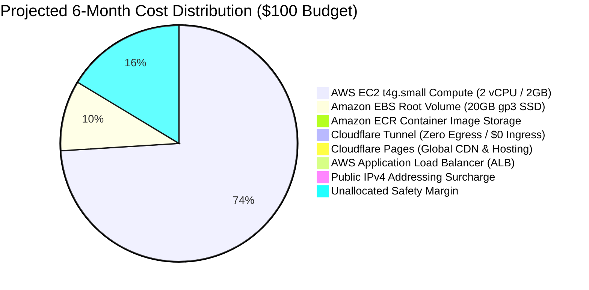
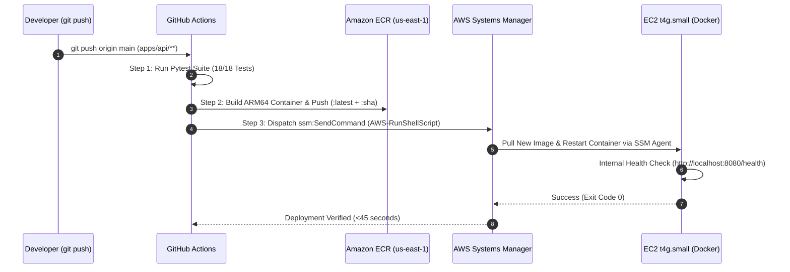

# ConnectRank Production Deployment & Cost Optimization Guide

[](https://pages.cloudflare.com)
[](https://aws.amazon.com/ec2/)
[](https://developers.cloudflare.com/cloudflare-one/connections/connect-networks/)
[](docs/DEPLOYMENT.md#1-financial-architecture--6-month-budget-model)
[](docs/DEPLOYMENT.md#2-aws-billing-alerts--cost-guardrails)
[](docs/ARCHITECTURE.md)
[](https://sentry.io)

This guide details the cost-engineered, high-performance production architecture for **ConnectRank**, pairing **Cloudflare Pages** for the static frontend ($0.00 egress & hosting) with a dedicated **AWS EC2 `t4g.small`** instance (AWS Graviton2 ARM64, 2 vCPU, 2 GB RAM) connected via **Cloudflare Tunnel (`cloudflared`)** for the containerized FastAPI inference engine.

---

## 1. Financial Architecture & 6-Month Budget Model

Our strict budget constraint is **$100.00 across 6 months** ($\approx \$16.66 / \text{month}$ ceiling). By replacing Amazon ECS Express Mode & its associated Application Load Balancer (~$54.00/mo) with a dedicated **`t4g.small`** instance and **Cloudflare Tunnel**, the infrastructure operates at **$\approx \$13.86 / \text{month}$**, leaving a **~$16.84 safety buffer** safely under the $100 ceiling.



### Comprehensive Cost Breakdown

| Component | Provider & Tier | Monthly Cost | 6-Month Total | Notes / Optimization |
| :--- | :--- | :--- | :--- | :--- |
| **Frontend Web App** | **Cloudflare Pages** (Free) | **$0.00** | **$0.00** | Unlimited bandwidth, 0 egress fees, free SSL, global Anycast edge CDN. |
| **Backend Compute** | **AWS EC2 `t4g.small`** (2 vCPU / 2GB) | **$12.26** | **$73.56** | AWS Graviton2 ARM64 on-demand ($0.0168/hr $\times$ 730 hrs/mo; or ~$8.40/mo on 1-yr Savings Plan). |
| **Storage & Swap** | **Amazon EBS** (20 GB gp3 SSD) | **$1.60** | **$9.60** | Includes 2 GB swapfile buffer preventing PyTorch OOM panics. Free if within AWS 30GB Free Tier. |
| **Ingress & Edge SSL** | **Cloudflare Tunnel** (`cloudflared`) | **$0.00** | **$0.00** | **Zero ALB fees** (eliminates ~$18/mo) and **Zero Public IPv4 fees** (eliminates $3.65/mo). |
| **Container Registry** | **Amazon ECR** (Private) | **~$0.10** | **~$0.60** | ARM64 container image tag (~1.1 GB); first 500 MB free, $0.10/GB for remainder. |
| **Data Transfer Out** | **AWS Out to Internet / Cloudflare** | **$0.00** | **$0.00** | AWS provides first 100 GB/month data transfer out for free. |
| **Observability / APM** | **Sentry** (Developer Free) | **$0.00** | **$0.00** | 5,000 error events & 10,000 performance transactions/month included. |
| **Safety Headroom** | **Unallocated Buffer** | — | **$16.24** | Absorbs traffic spikes or extra compute without breaching $100. |
| **Total Projected** | | **~$13.96 / mo** | **~$83.76** | **16.2% under $100 budget** |

---

## 2. Architecture Topology

```mermaid
flowchart TD
    subgraph Users ["Client Layer"]
        Browser["User Browser (Desktop / Mobile)"]
    end

    subgraph Cloudflare ["Cloudflare Edge Network ($0.00/mo)"]
        Pages["Cloudflare Pages CDN<br>• connectrank.flowkeit.com<br>• connectrank.pages.dev<br>• Zero Egress Bandwidth Fees"]
        EdgeSSL["Cloudflare Universal SSL Edge<br>• api.connectrank.flowkeit.com"]
        TunnelMesh["Cloudflare Anycast Tunnel Fabric<br>(Zero-Trust Ingress Edge)"]
    end

    subgraph AWS ["Amazon Web Services (us-east-1 — ~$13.96/mo)"]
        subgraph Host ["EC2 t4g.small Host (Graviton2 ARM64, 2 vCPU, 2 GB RAM)"]
            Cloudflared["cloudflared daemon (systemd service)<br>• Outbound-only QUIC/TLS (Port 7844/443)<br>• 0 Open Inbound Ports (0.0.0.0/0 blocked)"]
            AppContainer["Docker: connectrank-api:latest<br>• Uvicorn ASGI Server (:8080)<br>• PyTorch CPU + SentenceTransformers<br>• Strict Zero-Persistence In-Memory RAM Cache"]
            SwapBuffer["2 GB EBS Swapfile (Crash Buffer)"]
        end
        SSM["AWS Systems Manager (SSM)<br>• Zero-SSH Automated Deployment Agent"]
        ECR["Amazon ECR<br>(connectrank-api:latest / arm64)"]
    end

    subgraph CostControl ["Cost Control & Telemetry Guardrails"]
        Budgets["AWS Budgets ($15.00/mo Ceiling)<br>• 50%, 80%, 100% Alert Thresholds"]
        Alarms["CloudWatch Billing Alarm<br>• SNS Email Trigger at $12.00"]
        SentryCloud["Sentry APM (Free Tier)<br>• PII Redacted via before_send Hook"]
    end

    Browser -->|1. Static Assets GET (Instant Edge)| Pages
    Browser -->|2. POST /recommend (JSON REST API)| EdgeSSL
    EdgeSSL --> TunnelMesh
    TunnelMesh -.->|Outbound Multiplexed Tunnel| Cloudflared
    Cloudflared -->|Local Proxy (http://localhost:8080)| AppContainer
    AppContainer -.-> SwapBuffer
    SSM -.->|Automated Deployment (<45s)| AppContainer
    ECR -->|Container Image Layer| AppContainer
    Host -.-> CostControl
    Pages -.-> SentryCloud
    AppContainer -.-> SentryCloud
```

---

## 3. AWS Billing Alerts & Cost Guardrails (Mandatory Step)

To guarantee that your AWS account never exceeds the $100 limit, set up both **AWS Budgets** and **CloudWatch Billing Alarms** prior to launching:

### Step 3.1: Configure AWS Budgets ($15.00 Monthly Ceiling)

1. Open the [AWS Billing & Cost Management Console](https://console.aws.amazon.com/cost-management/home#/budgets).
2. Click **Create Budget** $\rightarrow$ Select **Cost Budget (Recommended)**.
3. Configure the budget parameters:
   - **Budget Name**: `connectrank-monthly-cost-cap`
   - **Period**: `Monthly`
   - **Budget Effective Date**: Current Month
   - **Budget Amount**: Fixed $\rightarrow$ **`$15.00`**
4. Configure **Alert Thresholds**:
   - **Alert 1**: Trigger at **50% ($7.50)** of budgeted amount (Actual) $\rightarrow$ Add your email address.
   - **Alert 2**: Trigger at **80% ($12.00)** of budgeted amount (Actual) $\rightarrow$ Add your email address.
   - **Alert 3**: Trigger at **100% ($15.00)** of budgeted amount (Forecasted) $\rightarrow$ Add your email address.
5. Click **Create Budget**.

### Step 3.2: Enable CloudWatch Billing Alarm (Estimated Charges)

1. Navigate to **Billing Preferences** in the AWS Billing Console and ensure **"Receive Billing Alerts"** is checked.
2. Open the [CloudWatch Console in `us-east-1` (N. Virginia)](https://console.aws.amazon.com/cloudwatch/home?region=us-east-1#alarmsV2:).
3. Click **Create Alarm** $\rightarrow$ Select metric **Billing $\rightarrow$ Total Estimated Charge $\rightarrow$ Currency: USD**.
4. Configure parameters:
   - **Statistic**: Maximum
   - **Period**: 6 hours
   - **Threshold**: Static $\rightarrow$ Greater than $\rightarrow$ **`$12.00`**
5. **Notification**: Select or create an SNS Topic (e.g. `connectrank-billing-alert`) and confirm subscription in your email inbox.

### Step 3.3: Cost Containment Guardrails

To prevent unexpected billing charges:
- Security Group allows **0 open inbound ports** (`0.0.0.0/0` ingress blocked).
- Session TTL in backend set to **`30`** minutes (`SESSION_TTL_MINUTES=30`).
- AWS Budgets ceiling configured at **`$15.00`** / month with multi-tier email alerts.

---

## 4. Environment Variables Specification

### Backend Environment Variables (`apps/api` on AWS EC2 `t4g.small`)

| Variable | Recommended Production Value | Required? | Purpose |
| :--- | :--- | :--- | :--- |
| `PORT` | `8080` | Yes | Internal HTTP listening port for container |
| `ENVIRONMENT` | `production` | Yes | Sentry environment grouping and logging mode |
| `CORS_ORIGINS` | `https://connectrank.flowkeit.com,https://connectrank.pages.dev,https://api.connectrank.flowkeit.com` | **Yes** | **Strict domain whitelist** (locks down API to your Cloudflare frontend) |
| `SESSION_TTL_MINUTES` | `30` | No (Default: 30) | Inactivity window before RAM session garbage collection |
| `MAX_UPLOAD_SIZE_MB` | `15` | No (Default: 15) | Prevents large multipart memory injection |
| `SENTRY_DSN` | `https://<key>@<org>.ingest.sentry.io/<id>` | Recommended | Server-side APM error tracking (PII redacted) |
| `SENTRY_TRACES_SAMPLE_RATE` | `0.1` | No (Default: 0.1) | APM distributed trace sample rate |

### Frontend Client Configuration (`apps/web/.env.production`)
| Variable | Recommended Production Value | Required? | Purpose |
| :--- | :--- | :--- | :--- |
| `VITE_API_URL` | `https://api.connectrank.flowkeit.com` | **Yes** | Root URL for REST API communication via Cloudflare Tunnel |
| `VITE_SENTRY_DSN` | `https://<key>@<org>.ingest.sentry.io/<id>` | Recommended | Client-side React Error Boundary reporting |

---

## 5. Backend Deployment (AWS EC2 `t4g.small` + Cloudflare Tunnel)

### Step 5.1: Build & Push ARM64 Image to Amazon ECR

Because `t4g.small` is an AWS Graviton2 (ARM64) instance, the Docker container must be built for `linux/arm64`:

```bash
# 1. Authenticate Docker with Amazon ECR (us-east-1)
aws ecr get-login-password --region us-east-1 | \
  docker login --username AWS --password-stdin 803647806810.dkr.ecr.us-east-1.amazonaws.com

# 2. Build the production image for linux/arm64 (Native on Apple Silicon Macs)
docker buildx build --platform linux/arm64 -t connectrank-api:latest -f apps/api/Dockerfile apps/api --load

# 3. Tag and push to Amazon ECR
docker tag connectrank-api:latest 803647806810.dkr.ecr.us-east-1.amazonaws.com/connectrank-api:latest
docker push 803647806810.dkr.ecr.us-east-1.amazonaws.com/connectrank-api:latest
```

### Step 5.2: Provision EC2 `t4g.small` & Attach IAM Role

1. **Launch Instance via EC2 Console (`us-east-1`)**:
   - **Name**: `connectrank-backend-host`
   - **AMI**: Amazon Linux 2023 (ARM64)
   - **Instance Type**: `t4g.small` (2 vCPU, 2 GB Memory)
   - **Key pair**: *Proceed without a key pair* (AWS Systems Manager provides secure terminal access)
   - **Storage**: 20 GB gp3 General Purpose SSD
   - **Network settings**:
     - Auto-assign Public IP: `Disable` (or leave default without Elastic IP)
     - Security Group: Create new (`connectrank-ec2-sg`) with **0 Inbound Rules** (completely closed).
2. **Attach IAM Instance Profile**:
   - Create role `ConnectRankEC2Role` with AWS managed policies:
     - `AmazonSSMManagedInstanceCore`
     - `AmazonEC2ContainerRegistryReadOnly`
   - Attach this role to the instance under **Actions $\rightarrow$ Security $\rightarrow$ Modify IAM role**.

### Step 5.3: Host Bootstrapping & Swapfile Setup

Connect to your instance via **EC2 Instance Connect / AWS Systems Manager Session Manager** (Console $\rightarrow$ Connect $\rightarrow$ Session Manager) and run:

```bash
# 1. Install and enable Docker
sudo dnf update -y
sudo dnf install -y docker
sudo systemctl enable --now docker
sudo usermod -aG docker ec2-user

# 2. Configure 2 GB swapfile buffer (prevents PyTorch OOM panics)
sudo fallocate -l 2G /swapfile
sudo chmod 600 /swapfile
sudo mkswap /swapfile
sudo swapon /swapfile
echo '/swapfile none swap sw 0 0' | sudo tee -a /etc/fstab

# 3. Install Cloudflare Tunnel daemon (ARM64)
sudo rpm -ivh https://github.com/cloudflare/cloudflared/releases/latest/download/cloudflared-linux-arm64.rpm
```

### Step 5.4: Connect Cloudflare Zero Trust Tunnel

1. Navigate to [Cloudflare Zero Trust Dashboard](https://one.dash.cloudflare.com/) $\rightarrow$ **Networks** $\rightarrow$ **Tunnels**.
2. Click **Add a tunnel** $\rightarrow$ Select **Cloudflared** $\rightarrow$ Name: `connectrank-production-tunnel`.
3. Copy the installation token command and run it in your EC2 terminal:
   ```bash
   sudo cloudflared service install <YOUR_TUNNEL_TOKEN>
   sudo systemctl enable --now cloudflared
   ```
4. Configure the **Public Hostname Route** in Cloudflare:
   - **Subdomain**: `api`
   - **Domain**: `connectrank.flowkeit.com`
   - **Service Type**: `HTTP`
   - **URL**: `localhost:8080`
   - **Additional HTTP Settings**: Enable `HTTP/2` support.

### Step 5.5: Run Container on EC2

```bash
# Authenticate Docker with Amazon ECR
aws ecr get-login-password --region us-east-1 | docker login --username AWS --password-stdin 803647806810.dkr.ecr.us-east-1.amazonaws.com

# Run the container
docker run -d \
  --name connectrank-api \
  --restart always \
  -p 8080:8080 \
  -e ENVIRONMENT=production \
  -e PORT=8080 \
  -e CORS_ORIGINS="https://connectrank.flowkeit.com,https://connectrank.pages.dev,https://api.connectrank.flowkeit.com" \
  -e SENTRY_DSN="https://72aecc10f4add3fcbe0ea00f0da00cea@o4512055866621952.ingest.us.sentry.io/4512055872978944" \
  -e SENTRY_TRACES_SAMPLE_RATE="0.1" \
  803647806810.dkr.ecr.us-east-1.amazonaws.com/connectrank-api:latest

# Verify health
curl http://localhost:8080/health
```

---

## 6. Frontend Deployment (Cloudflare Pages)

Cloudflare Pages provides automated Git deployments, unlimited bandwidth, and native SPA routing.

### Automatic Deployment via Git

1. In Cloudflare Dashboard $\rightarrow$ **Workers & Pages** $\rightarrow$ Select `connectrank`.
2. Configure Environment Variables:
   - `VITE_API_URL` = `https://api.connectrank.flowkeit.com`
   - `VITE_SENTRY_DSN` = `your_sentry_dsn`
   - `NODE_VERSION` = `22`
3. Click **Save and Deploy**.

### Direct CLI Deployment via Wrangler

```bash
# 1. Build the production bundle
VITE_API_URL="https://api.connectrank.flowkeit.com" \
pnpm --filter @connectrank/web build

# 2. Deploy via Wrangler
pnpm dlx wrangler pages deploy apps/web/dist --project-name connectrank
```

---

## 7. Post-Deployment Smoke Test Protocol

- [ ] **1. Public Tunnel Health Check**:
  ```bash
  curl -i https://api.connectrank.flowkeit.com/health
  # Expected: HTTP 200 OK with {"status":"healthy","version":"1.0.0"}
  ```
- [ ] **2. Strict CORS Verification**:
  ```bash
  curl -i -X OPTIONS https://api.connectrank.flowkeit.com/recommend \
    -H "Origin: https://connectrank.flowkeit.com" \
    -H "Access-Control-Request-Method: POST"
  # Expected: HTTP 200 with Access-Control-Allow-Origin: https://connectrank.flowkeit.com
  ```
- [ ] **3. End-to-End Search Experience**:
  - Open `https://connectrank.flowkeit.com` in an incognito window.
  - Upload CSV $\rightarrow$ confirm instant table rendering.
  - Test pitch vector search $\rightarrow$ verify response within $< 150\text{ms}$.
  - Test **"Purge My Data"** $\rightarrow$ confirm RAM memory is purged immediately.

---

## 8. Decommissioning Legacy ECS & ALB Infrastructure

> [!CAUTION]
> Execute these commands ONLY AFTER the new `https://api.connectrank.flowkeit.com` endpoint has been verified live to prevent any downtime.

```bash
# 1. Scale down and delete ECS Express Service (Stops ~$36/mo Fargate charge)
aws ecs update-service \
  --cluster default \
  --service connectrank-api \
  --desired-count 0 \
  --region us-east-1

# For ECS Express Mode services:
aws ecs delete-express-gateway-service \
  --service-arn "arn:aws:ecs:us-east-1:803647806810:service/default/connectrank-api" \
  --region us-east-1

# Alternatively for standard ECS services:
# aws ecs delete-service --cluster default --service connectrank-api --force --region us-east-1

# 2. Delete Application Load Balancer (Stops ~$18/mo ALB charge)
aws elbv2 delete-load-balancer \
  --load-balancer-arn "arn:aws:elasticloadbalancing:us-east-1:803647806810:loadbalancer/app/ecs-express-gateway-alb-f573e47a/3191a00a0a58a2a1" \
  --region us-east-1

# 3. Delete Target Groups
aws elbv2 delete-target-group \
  --target-group-arn "arn:aws:elasticloadbalancing:us-east-1:803647806810:targetgroup/ecs-gateway-tg-6e518539e27fd0a21/b7f9e528fcd4aa6b" \
  --region us-east-1

aws elbv2 delete-target-group \
  --target-group-arn "arn:aws:elasticloadbalancing:us-east-1:803647806810:targetgroup/ecs-gateway-tg-d9f982f1486a180a5/57ac198d581450c4" \
  --region us-east-1

# 4. Audit Remaining Services (Confirm LoadBalancers = 0, Tasks = 0)
aws elbv2 describe-load-balancers --region us-east-1 --query "LoadBalancers" --output table
aws ecs list-tasks --cluster default --region us-east-1 --query "taskArns" --output table
```

---

## 9. Automated CI/CD Pipeline (GitHub Actions & AWS Systems Manager)

ConnectRank includes an automated GitHub Actions CI/CD pipeline in [`.github/workflows/deploy-api.yml`](file:///Users/martinium-dev/projects/aws-projects/connectrank/.github/workflows/deploy-api.yml):



### Required GitHub Repository Secrets

Under **Settings $\rightarrow$ Secrets and variables $\rightarrow$ Actions**:

| Secret Name | Purpose | Value Description |
| :--- | :--- | :--- |
| `AWS_ACCESS_KEY_ID` | AWS CLI Authentication | Your IAM user access key. |
| `AWS_SECRET_ACCESS_KEY` | AWS CLI Secret | Your IAM user secret key. |
| `EC2_INSTANCE_ID` | Target Host Deployment | The instance ID of the `t4g.small` instance (e.g. `i-0123456789abcdef0`). |

